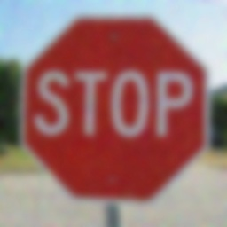
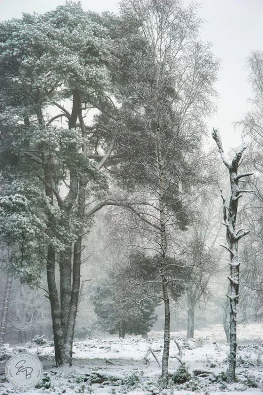
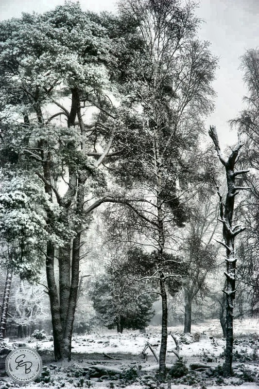

Markdown# 🖼️ Image Enhancement Project: Sharpening and Contrast Adjustment

[](https://www.python.org/)
[](https://opencv.org/)
[](https://jupyter.org/)

This repository implements advanced spatial domain filtering and histogram equalization techniques. Developed as part of the Digital Image Processing course, this implementation demonstrates practical applications of computer vision algorithms, serving as an excellent foundational preprocessing step for complex architectures like MobileNetV2.

---

<details open>
<summary><h2>🇬🇧 English Documentation</h2></summary>

### 🌟 Features

- **Image Sharpening**: Utilizes an unsharp masking technique with a specific $3 \times 3$ convolution kernel to restore sharpness in blurred images.
- **Contrast Enhancement**: Implements CLAHE (Contrast Limited Adaptive Histogram Equalization) by isolating the Luminance channel in the LAB color space for adaptive contrast improvement without over-exposure.
- **Professional Visualization**: Side-by-side comparison of original and enhanced images.

### 📁 Project Structure

```text
Image-Enhancement/
│
├── images/                   # Input images directory
│   ├── blured.jpg            # Blurred image sample
│   └── contrast.png          # Low-contrast image sample
│
├── hasil/                    # Output directory
│   ├── hasil_sharpen.jpg     # Sharpened image output
│   └── hasil_clahe.jpg       # CLAHE enhanced image output
│
├── venv/                     # Python virtual environment
├── Image-enhanced.ipynb      # Main Jupyter notebook
├── README.md                 # Project documentation
└── requirements.txt          # Python dependencies
⚙️ Installation & UsageClone the repository & enter the directory:Bashgit clone <repository-url>
cd image-enhancement-project
Create and activate the virtual environment:Bashpython -m venv venv
# Windows: venv\Scripts\activate
# Linux/Mac: source venv/bin/activate
Install dependencies:Bashpip install -r requirements.txt
Launch Jupyter Notebook: Open Image-enhanced.ipynb and run the cells sequentially.Bashjupyter notebook
🔬 Methodology & Key Functions1. Sharpening (unsharp_mask)Utilizes the following convolution kernel to emphasize object edges and reduce blur:Pythonkernel = [[-1, -1, -1],
          [-1,  9, -1],
          [-1, -1, -1]]
2. Contrast Enhancement (apply_clahe)Steps performed:Convert image from BGR → LAB color space.Extract the L (Luminance) channel.Apply CLAHE algorithm.Merge channels and convert back to BGR.📊 ResultsImage Sharpening<p align="center"></p>Contrast Enhancement (CLAHE)<p align="center"></p></details><details><summary><h2>🇮🇩 Dokumentasi Bahasa Indonesia</h2></summary>🌟 Fitur UtamaImage Sharpening: Menggunakan kernel konvolusi $3 \times 3$ untuk menonjolkan tepi objek dan mengurangi efek blur pada citra.Contrast Enhancement: Mengimplementasikan algoritma CLAHE pada channel luminance (ruang warna LAB) untuk meningkatkan kontras lokal tanpa menyebabkan over-exposure.Visualisasi Komprehensif: Menampilkan perbandingan before-after secara langsung menggunakan Matplotlib.⚙️ Instalasi & Cara MenjalankanClone repositori:Bashgit clone <repository-url>
cd project
Buat dan Aktifkan Virtual Environment:Bashpython -m venv venv
# Windows: venv\Scripts\activate
# Linux/Mac: source venv/bin/activate
Install Dependencies:Bashpip install opencv-python numpy matplotlib notebook ipykernel
Jalankan Jupyter Notebook: Buka file Image-enhanced.ipynb dan run semua cell secara berurutan.Bashjupyter notebook
🔍 Metode yang Digunakan1. SharpeningMenggunakan kernel konvolusi berikut untuk ekstraksi fitur tepi:Pythonkernel = [[-1, -1, -1],
          [-1,  9, -1],
          [-1, -1, -1]]
2. CLAHE (Contrast Limited Adaptive Histogram Equalization)Langkah pemrosesan:Konversi ruang warna citra dari BGR → LAB.Ambil channel L (Luminance).Terapkan CLAHE pada channel tersebut.Gabungkan kembali channel dan konversi ke BGR.🧠 AnalisisSharpening sangat efektif untuk meningkatkan ketajaman citra, namun perlu diperhatikan karena berpotensi menambah noise jika parameter terlalu tinggi.CLAHE memberikan hasil yang jauh lebih baik dibandingkan histogram equalization global biasa karena mampu menjaga detail lokal gambar.Kombinasi teknik-teknik ini memberikan fondasi preprocessing yang sangat optimal untuk analisis citra lebih lanjut.❗ Catatan TambahanPastikan file gambar (blured.jpg dan contrast.png) berada di dalam folder images/.Jangan menjalankan file .ipynb langsung menggunakan Python standar (gunakan Jupyter Notebook atau VS Code yang mendukung notebook).</details>👨‍💻 AuthorFaiz Jihad Al Baihaqi Teknik Informatika - Politeknik Negeri Indramayu (Polindra) Digital Image Processing Course Project📄 LicenseProyek ini dikembangkan untuk keperluan pembelajaran dan akademik.
**Langkah selanjutnya:**
Pastikan kamu benar-benar memiliki folder `images` dan `hasil` di dalam repositorimu
